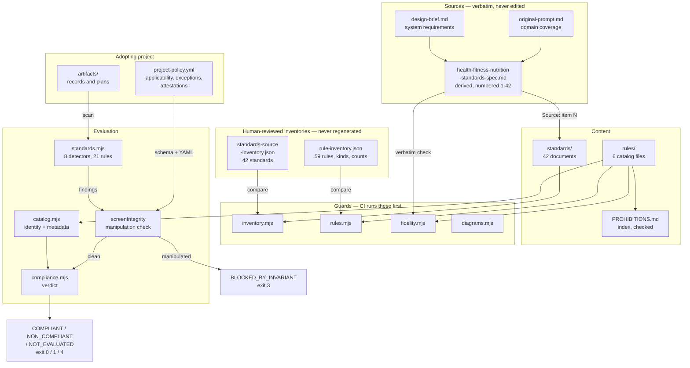

# Architecture — HealthAndFitnessAndNutritionStandards

> A standards pack: 42 numbered normative standards for personal health, fitness, and nutrition
> guidance, plus a zero-dependency CLI that evaluates an adopting project against them. Its users are
> the maintainers of projects that produce such guidance — applications, agents, analyses — and,
> increasingly, the AI agents working inside those projects.

This is the **reference** document: what exists, where, and how it behaves. The **design record** —
why the system is shaped this way, which policy-as-code concepts were adopted or rejected, and the
milestone plan — is [`design/architecture.md`](design/architecture.md).

## Tech Stack

| Layer | Technology |
| --- | --- |
| Runtime | Node.js ≥ 18, ESM (`"type": "module"`), `.mjs` throughout |
| Dependencies | **None.** No `dependencies`, no `devDependencies`, no lockfile, no install step in CI |
| Tests | `node:test` + `node:assert/strict` (built into Node 18+) |
| Parsers | Hand-written and vendored: a strict YAML subset (`scripts/yaml.mjs`) and a JSON Schema subset evaluator (`scripts/jsonschema.mjs`) |
| Content | Markdown (standards, templates, examples), JSON (rule catalog, inventories), YAML (policies) |
| Diagrams | Mermaid; `.mmd` is canonical (ADR 0006) |
| CI | GitHub Actions, single job, no install step |

The zero-dependency constraint is structural rather than aspirational: CI has no `npm ci`, so a
dependency cannot be added without the change being visible in `.github/workflows/ci.yml`.

## Runtime Processes

There is one: a CLI. No server, no database, no background jobs, no scheduled tasks, and no UI.
Those sections are omitted from this document because they have no subject here.

### `standards` CLI

**Entry point:** `scripts/standards.mjs` (also `bin: { "standards": "scripts/standards.mjs" }`)
**Host:** invoked directly, or via the `npm run` scripts
**Purpose:** evaluates a target directory against the catalog. Five subcommands, each answering a
different question, with deliberately different exit-code contracts.

| Subcommand | Reads policy | Writes files | Purpose |
| --- | --- | --- | --- |
| `init` | no | **yes** | Bootstrap an adopting project from `templates/` |
| `audit` | no | no | Run the detectors and emit findings — evidence, never a verdict |
| `check` | yes | no | Produce the verdict; the CI gate |
| `explain` | optional | no | Why a rule applies here, and what evidence would satisfy it |
| `status` | yes | no | What has expired, gone stale, or is awaiting review |

**Exit codes.** Three contracts that are deliberately not merged:

- `check` — `0` compliant · `1` non-compliant · `2` configuration or schema error · `3`
  `BLOCKED_BY_INVARIANT` · `4` `NOT_EVALUATED`
- `audit` — `0` completed · `1` `--strict` with non-`info` findings · `2` invocation error
- `init` — `0` completed · `1` conflicts, nothing written · `2` could not run

`1` means the tool worked and the repository has problems; `2` means it could not reach a conclusion
at all. `4` is not a worse `0`: mapping it to `0` would let a project that evaluated nothing pass a
gate, and mapping it to `1` would call a project non-compliant when nothing is known to be wrong.

## Guard Scripts

Five standalone checks, run by CI **before** the test suite because each answers a question the tests
assume. Each exposes a pure `analyse()` alongside its CLI `main()`, so the mutation tests call the
analysis directly rather than testing the guard through its command-line skin.

### `scripts/inventory.mjs`
**Purpose:** proves the standards series has not silently changed shape. Extracts numbered items from
the derived specification with `ITEM_RE` and compares against `artifacts/standards-source-inventory.json`,
which is human-reviewed and **never regenerated from a run**.
**Reports:** missing, unknown, duplicate, and renamed numbers; unclaimed standards files; unwritten
standards.
**Notable:** separates two questions. "Has the series changed shape" always fails; "is every standard
written yet" fails only at a release version, with strictness read from `VERSION` rather than a flag,
because a flag works right up until someone leaves it on.

### `scripts/rules.mjs`
**Purpose:** the tamper evidence of ADR 0003. Loads the catalog and compares every rule id, kind,
severity, and standard against `artifacts/rule-inventory.json`, plus separately-pinned counts
(13/11/10 prohibitions, 1 invariant).
**Notable:** the counts are pinned separately from the rule list so the two must agree with each other
as well as with the catalog — editing one and forgetting the other is itself the signal.

### `scripts/fidelity.mjs`
**Purpose:** verifies that everything claiming to be source text is source text. Two targets: blocks
in `standards/*.md` preceded by an explicit verbatim claim, and the `description` of every rule of
kind `prohibition` (convention: `Never <source bullet>`).
**Notable:** reads its source path from the inventory's `source` field rather than hard-coding it, so
the two guards cannot disagree about which document is the source. Normalises line wrapping but *not*
backticks, punctuation, or wording — those are what it exists to catch.

### `scripts/policy.mjs`
**Purpose:** validates a policy in three layers — strict YAML parse, JSON Schema validation, then
semantic checks the schema cannot express because it does not know the catalog.
**Reports:** unknown rule ids, exceptions against prohibitions, lowered strengths, contradictory
not-applicable-plus-exception, attestations on non-attestable rules, missing revisit triggers, and
undeclared rules.
**Notable:** warns when a prohibition's not-applicable reason reads as a preference ("some users
want…") rather than a limit of scope. A heuristic, reported as a warning, because it cannot judge
honesty.

### `scripts/diagrams.mjs`
**Purpose:** every `.mmd` must appear verbatim as a fenced block in some `.md`; any `.svg` must record
the digest of its source; an `.svg` with no `.mmd` is a finding.
**Notable:** compares text, requiring no Mermaid toolchain — which is what lets a zero-dependency
repository enforce the rule at all.

## Evaluation Engine

### `scripts/catalog.mjs`
**Responsibility:** the single source of machine truth for rule identity and metadata.

Holds the architectural rule the whole system rests on: *the catalog defines identity, the policy
defines applicability, the evaluator produces evidence, and none may redefine the others.*
`assertBindings()` enforces the last of those — an evaluator reporting an id the catalog does not
define throws.

**Enforced at load time** (a malformed entry throws rather than loading partially, because a partial
load silently shrinks the denominator of every count):

- canonical id `category.kebab-case-name` (`CANONICAL_ID`)
- `kind` ∈ requirement / recommendation / prohibition / invariant
- a prohibition or invariant that is not `severity: error` fails
- a `manual-review` rule claiming `assurance: full` fails
- an invariant declared `attestable: true` fails
- lifecycle fields present even when null

**Exports:** `loadCatalog`, `resolve`, `assertBindings`, `coverage`, `isExemptible`,
`mayBeNotApplicable`.

### `scripts/compliance.mjs`
**Responsibility:** catalog + policy + findings → verdict.

`screenIntegrity()` runs **first and globally**. It detects five manipulation patterns and, if any
fires, returns `BLOCKED_BY_INVARIANT` with nothing else evaluated:

1. an exception against a prohibition or the invariant
2. a lowered strength, or a strength set on a prohibition or the invariant
3. the invariant declared not-applicable
4. a not-applicable declaration contradicted by a finding **that establishes the subject exists**
5. an attestation on the invariant, on a non-attestable rule, or contradicted by a finding

Case 4 is the subtle one. Findings carry `subjectExists`; only a finding presupposing the artifact
exists can contradict a scope claim. An *absence* ("no fitness plan") is evidence **for** a
declaration that the project plans no training. Without the distinction every correctly-scoped project
would be reported as an integrity violation.

Deliberately **not** treated as manipulation: a stale attestation digest. Files legitimately change;
returning the rule to not-evaluated is the mechanism working, and a guard that fires on ordinary edits
is one people route around.

`evaluate()` then decides per rule: not-applicable → attestation → not-evaluated → passed → failed.
`summarise()` computes counts, the assurance breakdown (which must sum to the applicable rules), the
score, and the status.

**Status precedence:** integrity violations → no policy → any failure → **any applicable required
rule that nothing established** → any exception → compliant. The fourth clause is why a well-formed
project reports `NOT_EVALUATED`: nothing failing is not evidence that anything passed.

### `scripts/standards.mjs` — the detectors

`EVALUATED_RULES` names the 21 rules a detector examines. Anything in the catalog and not in that list
reports `not-evaluated`, never `passed`; a test asserts the list and the detectors agree.

| # | Detector | Looks for | Binds to |
| --- | --- | --- | --- |
| D1 | interpretation records | `artifacts/interpretations/*.md` exists | `health.interpretation-record` |
| D2 | record sections | six headings present and non-empty per record | six `health.*-recorded` rules |
| D3 | tier label | exactly one canonical tier in `## Escalation Tier` | `health.escalation-tier-assigned` |
| D4 | tier model | `docs/escalation-tiers.md` names all four tiers | `escalation.tier-model-documented` |
| D5 | scope disclosure | a wellness-scope statement in README, manifest, docs, or templates | `escalation.scope-disclosed` |
| D6 | trend principle | the principle stated anywhere in the tree | `trend.principle-documented` |
| D7 | fitness plan | `artifacts/fitness-plan.md` + six headings | `fitness.plan-documented` + 5 |
| D8 | nutrition plan | `artifacts/nutrition-plan.md` + headings + named targets + provenance markers | `nutrition.plan-documented` + 4 |

**What every detector can claim: that an artifact or section EXISTS.** None reads content for
correctness. All 21 bound rules carry `assurance: "partial"` and an `$assuranceNote` stating what the
check cannot establish. Two (D4 and D8's targets check) are substring scans and cannot distinguish a
stated target from a passing mention; both say so.

`makeFinder()` throws if a detector omits `subjectExists`, so a new detector cannot silently default
to either answer.

**Scanning:** `collectFiles()` walks the tree skipping `SKIP_DIRS` (which includes `fixtures`, so
deliberately broken test data cannot indict the tool), reading only text extensions, capped at
`MAX_FILES` 20000 and `MAX_READ_BYTES` 400 000. `sectionBody()` returns `null` for a missing heading
and `""` for an empty one — the distinction every section rule turns on. HTML comments are stripped so
a heading named in a template's explanatory comment does not count.

### `scripts/init.mjs`
**Responsibility:** bootstrap an adopting project.

`plan()` is pure and returns an action list; `apply()` is the only writer and executes exactly that
list. `--dry-run` is `plan()` without `apply()`, which satisfies the design brief's requirement that
dry-run and apply derive from the same plan **by construction** rather than by discipline.

Action kinds: `create`, `preserve` (identical to template), `conflict` (exists and differs — nothing
written, exit 1), `overwrite` (only with the exact path named in `--force-overwrite`), `mkdir`,
`missing-template`. Artifact directories are created **empty**: writing a specimen interpretation
record into a real project would seed it with fabricated measurements, which Standard 5 prohibits.

## Content

### `standards/` — 42 documents
`NN-<kebab-title>.md`, contiguous from 1, no frontmatter. Each carries: an H1, a thesis paragraph, a
`Source: item N of …` line, `## Scope`, `## Requirements` (with `### R1 —` subsections), a
`## Prohibitions` section where it owns any, `## Additions this standard makes beyond the source`, an
optional `## Relationship to other standards`, and a mandatory `## Implementation` that is honest
about what is built versus specified.

Eleven standards carry no rule of their own and each says so in its Implementation section, with the
reason — a test enforces that disclosure.

### `rules/` — 6 catalog files, 59 rules

| File | Rules | Contents |
| --- | --- | --- |
| `health.json` | 21 | 13 prohibitions + 8 |
| `fitness.json` | 17 | 11 prohibitions + 6 |
| `nutrition.json` | 15 | 10 prohibitions + 5 |
| `escalation.json` | 3 | cross-domain: the wellness/medical boundary and the tier model |
| `trend.json` | 2 | cross-domain: the trend-over-event principle |
| `integrity.json` | 1 | the invariant |

By kind: 34 prohibitions, 17 requirements, 7 recommendations, 1 invariant.

### `schemas/project-policy.schema.json`
JSON Schema 2020-12, `additionalProperties: false` throughout. Four mechanisms: `rules`,
`applicability`, `exceptions`, `attestations`. `$defs.ruleId` carries the canonical id pattern —
the same string as `CANONICAL_ID` in the loader and Standard 42 — so a misspelled key is an error
rather than a declaration about a rule that does not exist.

### `artifacts/` — sources and reviewed inventories
`prompts/` holds the two source documents verbatim plus the derived numbered specification.
`standards-source-inventory.json` and `rule-inventory.json` are the human-reviewed enumerations that
make the guards tamper evidence rather than typo checks; both carry a `$comment` stating they are
never regenerated. `adr/` holds six decision records.

## Data Flow

A `standards check .` run, end to end:

1. `main()` in `scripts/standards.mjs` parses the subcommand and resolves the target directory.
2. `loadCatalog("rules")` reads all six catalog files, validating every entry; a malformed rule
   throws `CatalogError` and the run stops.
3. `loadPolicy(root)` reads `project-policy.yml` through `parseYaml()` (strict subset), then
   `assertSchemaSupported()` and `validate()` from `jsonschema.mjs`. Any failure exits 2.
4. `runDetectors(root)` walks the tree and runs D1–D8, producing findings that each carry a `rule`
   binding and a `subjectExists` flag.
5. `assertBindings()` confirms every reported rule id exists in the catalog.
6. `attestationDigests()` hashes the `reviewedAgainst.paths` of each attestation.
7. `evaluate()` calls `screenIntegrity()` first. If it returns violations, the verdict is
   `BLOCKED_BY_INVARIANT`, `results` is empty, and the process exits 3.
8. Otherwise each catalog rule is decided in order and `summarise()` produces the verdict.
9. `envelope()` wraps it with `frameworkCoverage` from `coverage()` — reported **beside** the score,
   never merged into it.
10. `renderCheck()` prints, and the exit code follows the status.

## Key Patterns & Conventions

- **`validationType` vs `assurance`** — what kind of check a rule calls for, versus what the current
  implementation can establish. Separate fields because conflating them is how false-green compliance
  happens. Canonical example: any rule in `rules/health.json`.
- **`kind` over `level` + a boolean** — prohibitions are a rule *type*, not a flag on a requirement
  (ADR 0002). See `scripts/catalog.mjs` `KINDS`.
- **Reviewed inventories, never regenerated** — the property that makes a guard tamper evidence.
  `artifacts/rule-inventory.json`.
- **Pure `analyse()` + `main()` behind an entry-point check** — every guard, so mutation tests call
  the logic directly. `scripts/inventory.mjs`.
- **Checked, not generated** — `PROHIBITIONS.md` is hand-written with a test asserting it matches the
  catalog. A stale generated file looks exactly like a current one; a checked one breaks loudly.
- **Examples reused as fixtures** — `test/fixtures/compliant-adopter/` is built from `docs/examples/`,
  so an example that stopped satisfying the standards fails the build.
- **Fire and do-not-fire pairs** — every detector asserted twice in `test/audit.test.mjs`.
- **Strictness from `VERSION`, not from flags** — `scripts/inventory.mjs` `isPrerelease()`.

## Entry Points for Common Tasks

| Task | Where to start |
| --- | --- |
| Add or change a rule | `rules/<category>.json`, then update `artifacts/rule-inventory.json` in the same commit — `npm run rules` will insist |
| Add a detector | `runDetectors()` in `scripts/standards.mjs`; add its rule id to `EVALUATED_RULES`; add a fire/do-not-fire pair to `test/audit.test.mjs` |
| Add a standard | `standards/NN-*.md`, plus an entry in `artifacts/standards-source-inventory.json` and a numbered line in the derived spec |
| Change what `init` writes | `ARTIFACTS` / `DIRECTORIES` in `scripts/init.mjs`, plus the template in `templates/` |
| Change the policy shape | `schemas/project-policy.schema.json`, and the semantic checks in `inspect()` in `scripts/policy.mjs` |
| Add an integrity check | `screenIntegrity()` in `scripts/compliance.mjs`, plus a fixture in `test/fixtures/policies/` |
| Change a template heading | `templates/*.md` **and** the matching `*_SECTIONS` array in `scripts/standards.mjs` — `test/templates.test.mjs` asserts they agree |

## Diagram

`docs/architecture.mmd` is the canonical source for the block above; `npm run diagrams` fails if they
diverge. **No `.svg` is committed** — rendering one requires a Mermaid toolchain, which would mean an
install step and therefore a third-party dependency. ADR 0006 permits the absence provided it is
declared, and this is the declaration.

## Known Gaps

- No detector reads content for correctness; all 21 establish presence only.
- Two detectors are substring scans (D4, and D8's targets check) and cannot distinguish a stated
  target from a passing mention. Both carry an `$assuranceNote` saying so.
- Nothing evaluates a prohibition. All 34 report not-evaluated without a recorded human review.
- The allergen check of Standard 41 R2 is deliberately unbuilt: detectors read documents, not runtime
  data, and a check that appeared to verify allergen safety without that access would be the most
  dangerous false green this system could produce.
- Detector paths are fixed (`artifacts/interpretations/`, `artifacts/fitness-plan.md`,
  `artifacts/nutrition-plan.md`, `docs/escalation-tiers.md`). A project using a different layout must
  declare the rules not-applicable rather than configure the paths.
